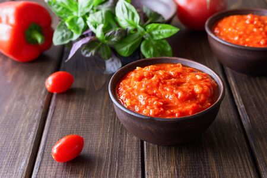

# Azajar spagettisaus uit de balkan

:::::::::::::: {.columns}
::: {.column width="40%"}

## Ingrediënten

<!-- - 1 pan -->
- 3 rode paprika's
- 1/2 chili peper
- 1 medium aubergine (eggplant)
- 2 teentjes look
- 1 el. olijfolie
- 1 el. azijn
- peper en zout
- 2 el. fijngesneden peterselie

- 1 fijngesneden selderij (optie)
- 1 el. suiker (optie)

:::
::: {.column width="60%"}

##

$Lunch \hspace{0.15cm} | \hspace{0.15cm} Spicy \hspace{0.15cm} | \hspace{0.15cm} Veggie$

{width=70%}

$**°°° \hspace{0.15cm} | \hspace{0.15cm} 25    \hspace{0.05cm} min \hspace{0.15cm} | \hspace{0.15cm} 8    \hspace{0.05cm} pers.$

:::
::::::::::::::

## Bereiding

1. Gril de paprika, peper en aubergine in de oven (verwijder de pitjes)
2. Mix de gegrilde groenten en doe in een steelkom
3. Voeg de geperste teentjes look toe, olijfolie, azijn, peper en zout
4. Roer goed door
5. Voeg de peterselie toe (en opties)

<!-- -------------------------------------------------- -->